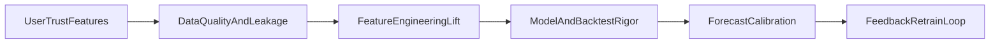

# Forecaster Improvements Backlog

This document tracks post-V1 work to improve user value, predictive accuracy, forecasting reliability, and operational trust.

## Immediate (1-2 weeks)

### Product value and trust
- ~~Add a comparables panel in Forecaster V1:~~
  - nearest/similar recent transactions,
  - similarity score and distance explanation,
  - comparable median/IQR for pricing sanity checks.
  - Impact: improves user trust and practical decision support.
  - Verify: user can explain prediction with comparables in one screen.
- ~~Add confidence/reliability score in prediction output:~~
  - based on data density, out-of-range flags, and segment error history.
  - Impact: clearer decision risk awareness.
  - Verify: confidence score decreases in sparse/OOD scenarios.
- ~~Add explicit alert rules:~~
  - out-of-distribution inputs,
  - low sample support by town/flat segment,
  - wide interval warning.
  - Impact: prevents overconfident interpretation.
  - Verify: alerts trigger on known edge-case profiles.

### Quality and transparency
- ~~Add town/flat-type error slices from `metadata.json` directly in forecaster UI.~~
- ~~Add model-card markdown generated per training run.~~
- ~~Resolve MLflow vulnerability findings (upgrade to remediated release, re-audit).~~
  - Impact: closes known security risk in tracking stack.
  - Verify: `pip-audit -r requirements.txt` no longer reports known MLflow CVEs.

## Near-term (2-6 weeks)

### Prediction accuracy lift
- ~~Add richer location and accessibility features (only with measurable gain):~~
  - ~~MRT network travel-time features,~~
  - ~~school-zone attributes,~~
  - ~~URA planning overlays.~~
  - ~~Impact: captures location premium more realistically.~~
  - ~~Verify: out-of-time MAE/RMSE improves vs current baseline.~~
  - Implementation note:
    - official MRT references now sourced from data.gov.sg APIs,
    - OneMap-based travel-time feature export added (`data/reference/mrt_travel_time_to_cbd.csv`),
    - school/lifestyle premiums are currently delivered as explicit scenario overlays in UI
      (not yet trained as causal model coefficients).
- ~~Add leakage-safe lagged market features:~~
  - ~~rolling town/flat medians and liquidity indicators using strict historical cutoffs.~~
  - ~~Impact: better market-state representation.~~
  - ~~Verify: no future leakage in feature generation tests.~~
- ~~Add model blending experiments:~~
  - ~~tree model + comparables anchor blend,~~
  - ~~governed by holdout/backtest performance.~~
  - ~~Impact: stabilizes noisy point predictions.~~
  - ~~Verify: lower test RMSE without interval miscalibration.~~

### Forecasting reliability
- ~~Add rolling-origin backtests (multiple windows, not single holdout).~~
- ~~Add interval calibration report (coverage by segment/time window).~~
- ~~Add exogenous-aware forecasting ablations (rates/policy lags) with strict baseline comparisons.~~
  - ~~Impact: more realistic trajectory confidence and fewer false trends.~~
  - ~~Verify: calibration gap and backtest errors improve consistently.~~

## Mid-term (6-12 weeks)

### User workflows
- Add scenario simulator:
  - vary transaction month, lease, floor area, and town assumptions,
  - show delta impacts and uncertainty shifts.
  - Impact: decision planning rather than static prediction lookup.
  - Verify: scenario outputs are reproducible and explainable.
- Add segment-focused views:
  - buyer mode (affordability/downside),
  - seller mode (listing range),
  - investor mode (yield + volatility + lease-risk profile).
  - Impact: relevance across user intents.
  - Verify: each mode exposes tailored KPIs and actions.

### Ops and lifecycle
- Add drift report command:
  - feature drift + residual drift since last training run.
- Add scheduled retraining with artifact version pinning.
- Add feedback-to-retraining pipeline:
  - leverage user ratings + actual sale outcomes when available.
  - Impact: continuous model improvement loop.
  - Verify: retrain job produces signed artifact and changelog entry.

## Deferred / Guardrails

- Trajectory deep models (Prophet/LSTM) as optional experimental track only.
- Full model registry and approval gates (staging vs production) after stable pipeline maturity.
- Online serving API (FastAPI) with auth/rate-limits/audit logs only after usage justifies ops overhead.
- End-to-end automatic retraining triggers from live events remain deferred.
- Do not adopt deep-learning-first architecture before repeatable lift over tabular baselines.
- Do not broaden macro feature ingestion without out-of-time performance gains.

## Next Implementation Plan

### Phase 1: Trust-first output hardening
- Deliverables:
  - comparables panel,
  - confidence score,
  - OOD/sparsity/interval alerts.
- Acceptance criteria:
  - prediction screen includes trust signals and contextual comparables,
  - alerts fire correctly on known edge cases.

### Phase 2: Leakage-safe feature upgrades
- Deliverables:
  - location/accessibility feature set,
  - strict lagged market features.
- Acceptance criteria:
  - feature pipeline has no temporal leakage,
  - measurable out-of-time error improvement.

### Phase 3: Evaluation and calibration rigor
- Deliverables:
  - rolling-origin backtest module,
  - interval calibration report by segment.
- Acceptance criteria:
  - calibration/report artifacts generated per run,
  - metrics are stable across windows (not one-off wins).

### Phase 4: User workflow depth
- Deliverables:
  - scenario simulator,
  - buyer/seller/investor mode dashboards.
- Acceptance criteria:
  - each mode supports a clear user action path,
  - outputs remain consistent with core model assumptions.

### Phase 5: Lifecycle hardening and security closure
- Deliverables:
  - scheduled retraining + artifact pinning,
  - drift detection command,
  - feedback-aware retraining path,
  - MLflow security remediation and re-audit.
- Acceptance criteria:
  - reproducible retraining runs on schedule,
  - drift signals are monitored,
  - vulnerability audit has no unresolved high/critical items in active stack.
